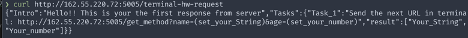

# Homework - Linux terminal commands

*Задание выполняется в Терминале на MacOS*

1. Посмотреть где я:

`pwd` print working directory

2. Создать папку:

`mkdir directory name` make directory

3. Зайти в папку:

`cd directory name` change directory

4. Создать 3 папки:

- `mkdir {folder1,folder2,folder3}`
где названия папок перечислены без пробелов

- или `mkdir folder {1,2,3}`
если у папок должен отличаться только постфикс

Пример:
```mkdir {bash_1,bash_2,bash_3}```
</ul>

5. Зайти в любую папку:

Пример:
`cd bash_1`

6. Создать 5 файлов (3 txt, 2 json)

#### Создание трех файлов .txt:

- **Вариант 1**

  создаем “пустой” текстовый файл → `touch -c filename`
параметр -с гарантирует то, что будет создан новый файл и если существует файл с таким же именем, то в него не будут внесены изменения временнЫх меток

Пример:
```touch -c textfile1.txt```

- **Вариант 2**

  создаем текстовый файл с каким-то текстом `echo “text” > filename.txt`

Пример:
```echo “This is text for textfile” > textfile2.txt```
  

- **Вариант 3**

    создаем файл при помощи редактора vim:

  - `vim filename.txt → enter`
где filename - это имя нового файла
  - переходим в режим правки → i (insert)
  - набираем текст
  - выходим из редактора в обычный режим → esc
  - сохраняем файл → :w (write)
  - выходим из режима редактирования → :q (quit)

#### Создание двух файлов .json
*можно использовать любой из способов, указанных для создания файлов .txt*

Пример:
`touch {j_file1.json,j_file2.json}`

7. Создать 3 папки

Пример: `mkdir {bash_4,bash_5,bash_6}`

8. Вывести список содержимого папки

перейти в какую-нибудь папку: `cd → ls` (list)

9. И открыть любой txt файл
10. И написать туда что-нибудь, любой текст 
11. И сохранить и выйти
```
Решение 8,9,10,11:
- перейти в папку размещения файла при помощи команды cd 
- воспользоваться командой echo > для записи данных в файл
- объединить две команды при помощи &&

`cd bash_1 && echo "записать 555" > textfile2.txt`
```

если нужно ДОписать какой-то текст, то нужно использовать >>
`cd bash_1 && echo "дописать 777" >> textfile2.txt`

12. Выйти из папки на уровень выше
`cd ..`

--------

13. Переместить любые 2 файла, которые вы создали, в любую другую папку

- если перемещаемые файлы и папка назначения находятся в разных местах, то пишем полный или относительный путь и названия файлов не дублируем. 
Новое имена файлов нужно писать в том случае, если их нужно переименовать.

`mv  /home/usr/dir/{file1,file2} /home/usr/destination/`
где названия файлов перечислены без пробелов

Пример:
`mv /Users/xoborobo/Learning/vadimksendzov/homeworks/{tx11.txt,tx22.txt} /Users/xoborobo/Learning/vadimksendzov/homeworks/1_bash_080222`

- если перемещаемые файлы и папка назначения находятся в одной директории, то полный путь писать не обязательно 
`mv {file1,file2} destination`

  - Пример без полного пути:
  `mv {textfile1.txt,textfile2.txt} bash_1`

  - Пример с указанием пути:
  `mv {textfile1.txt,textfile2.txt} /Users/xoborobo/Learning/vadimksendzov/homeworks/1_bash_080222/bash_1`

14. Скопировать любые 2 файла, которые вы создали, в любую другую папку

- если перемещаемые файлы и будущая папка размещения находятся в разных директориях, то пишем полный путь и названия файлов не дублируем. Новые имена файлов нужно писать в том случае, если их нужно переименовать.

`cp  /home/usr/dir/{file1,file2} /home/usr/destination/` где названия файлов перечислены без пробелов

- если перемещаемые файлы и будущая папка размещения находятся в одной директории, то полный путь писать не нужно
`cp  {file1,file2} /home/usr/destination/`

Пример:
`cp {j_file1.json,j_file2.json} bash_2`

15. Найти файл по имени

Пример: `find . -name textfile1.txt`

*желательно перейти в директорию "поближе" к потенциальному размещению файла или указать более конкретный путь, иначе поиск будет производиться везде и может занять много времени.*

16. Просмотреть содержимое в реальном времени (команда grep) изучите как она работает.find

- если находимся в той же директории, где размещен отслеживаемый файл, то полный путь не нужно
`tail -F textfile1.txt` 
*большая F для того, чтобы работала на macOS*

- если находимся где-то в системе, то указываем полный путь до отслеживаемого файла `tail -F /home/usr/folder/textfile1.txt` 

Пример:
`tail -F /Users/xoborobo/Learning/vadimksendzov/homeworks/1_bash_080222/bash_1/textfile1.txt`

17. Вывести несколько первых строк из текстового файла

`head -n5 путь к файлу`
где 5 - это число строк в начале файла, которые хотим посмотреть

Пример: `head -n5 /Users/xoborobo/Learning/vadimksendzov/homeworks/1_bash_080222/bash_1/textfile1.txt`

18. Вывести несколько последних строк из текстового файла

`tail -5 путь к файлу`
по умолчанию выводятся 10 последних строк содержимого файла, но помощи числа в аргументе это кол-во можно изменять

Пример:
`tail -5
/Users/xoborobo/Learning/vadimksendzov/homeworks/1_bash_080222/bash_1/textfile1.txt`

19. Просмотреть содержимое длинного файла (команда less) изучите как она работает


`less путь к файлу` → q - выход


21. Вывести дату и время

`date`

-------

## Задание *
22. Отправить http запрос на сервер http://162.55.220.72:5005/terminal-hw-request

Решение:


Задаем переменные и снова отправляем новый запрос http://162.55.220.72:5005/get_method?name=xbrb&age=39. Получаем ответ, согласно заданию:



22. Написать скрипт который выполнит автоматически пункты 3, 4, 5, 6, 7, 8, 13

```
3 - зайти в папку
4 - создать 3 папки
5 - зайти в любую папку
6 - создать 5 файлов (3 txt, 2 json)
7 - создать 3 папки
8 - вывести список содержимого папки
13 - переместить любые 2 файла, которые вы создали, в любую другую папку.
```


делаем файл исполняемым 
chmod +x ./myscript

```
#!/bin/bash

student="xbrb"
echo HW1_g27_Terminal_1 from $student

cd /Users/xoborobo/Learning/vadimksendzov/homeworks/1_bash_080222/bash_script
mkdir bashS{1,2,3}

cd /Users/xoborobo/Learning/vadimksendzov/homeworks/1_bash_080222/bash_script/bashS1

touch {bsfile1.txt,bsfile2.txt,bsfile3.txt,bsfile1.json,bsfile2.json}

cd ../
mkdir bashS{4,5,6}

ls

cd bashS1
mv {bsfile1.txt,bsfile2.txt} /Users/xoborobo/Learning/vadimksendzov/homeworks/1_bash_080222/bash_script/bashS2
```
